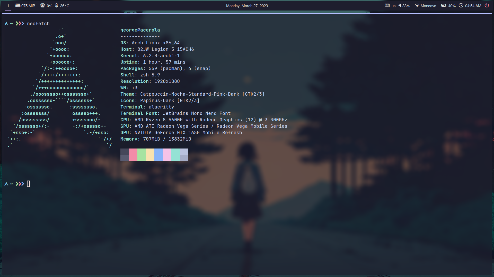
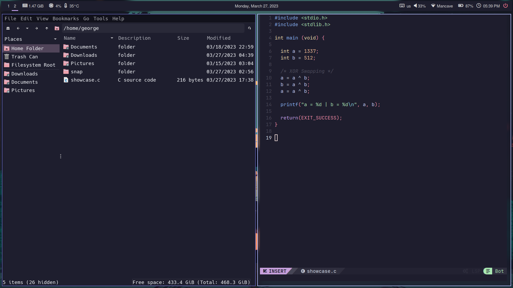

# Personal dotfile repository

This repository contains configuration files for my laptop Arch Linux setup.

## Components

* Window Manager: [`i3`](https://i3wm.org/)  
* Bar: [`Polybar`](https://github.com/polybar/polybar)
* Prompt: [`Starship`](https://starship.rs/)
* Compositor: [`picom`](https://github.com/yshui/picom)
* Terminal: [`Alacritty`](https://github.com/alacritty/alacritty)   
* Shell: [`zsh`](https://archlinux.org/packages/extra/x86_64/zsh/)
* Editor: [`NvChad`](https://nvchad.com/) 
* File Manager: [`PCManFM`](https://archlinux.org/packages/community/x86_64/pcmanfm/)
* App Launcher: [`Rofi`](https://github.com/davatorium/rofi)
* Clipboard Manager: [`greenclip`](https://github.com/erebe/greenclip)
* Screenshot Tool: [`shotgun`](https://github.com/neXromancers/shotgun)
* Audio Visualizer: [`Cava`](https://github.com/karlstav/cava)
* GTK Theme: [`Catppuccin Mocha`](https://github.com/catppuccin/gtk) (Pink Dark)
* Icons: [`Papirus`](https://github.com/PapirusDevelopmentTeam/papirus-icon-theme) (with Maroon folder color via [catppuccin/papirus-folders](https://github.com/catppuccin/papirus-folders))

## Additional Dependancies

### Shell Plugins:

* [`zsh-autosuggestions`](https://github.com/zsh-users/zsh-autosuggestions)
 
* [`zsh-vi-mode`](https://github.com/jeffreytse/zsh-vi-mode)

### Other:
  [`Nerdfonts`](https://www.nerdfonts.com/font-downloads) (my config uses Hack and JetBrainsMono)

  **Font Awesome**
  ```
  sudo pacman -S ttf-font-awesome
  ```
  **brightnessctl** for brightness control
  ```
  sudo pacman -S brightnessctl
  ```
  **PipeWire** for sound
  ```
  sudo pacman -S pipewire pipewire-alsa pipewire-pulse pipewire-jack wireplumber
  ```
  add the following line to *~/.xinitrc*
  ```
  wireplumber &
  ```
  **playerctl** for controlling media players
  ```
  sudo pacman -S playerctl
  ```
  **rofi-bluetooth-git** for controlling bluetooth via rofi
  ```
  yay -S rofi-bluetooth-git
  ```

 ## Preview





